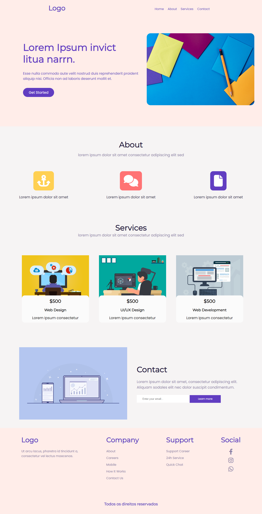

# Commercial Landing Page
Essa é uma landing page comercial que fornece uma base sólida para você criar uma página de destino para sua empresa. Sinta-se à vontade para adaptar o código e adicionar mais recursos de acordo com suas necessidades específicas.



# Recursos
Essa Landing page comercial possui os seguintes recursos:

- Desing responsivo que se adapta a diferentes tamanhos de tela.
- Navegação fácil e intuitiva.
- Seção "Sobre" que destaca as informações da empresa.
- Seção de "Serviços" que lista os serviços oferecidos pela empresa
- Seção de "Contato" com um formulário de contato para os visitantes entrarem em contato com a empresa.
- Rodapé com links para informações adicionais e redes sociais.


# Tecnologias
As seguintes tecnologias foram utilizadas para desenvolver essa landing page:

- HTML: Linguagem de marcação utilizada para estruturar o conteúdo da página.
- CSS: Linguagem de estilo utilizada para definir a aparência e o layout da página.
- JavaScript: Linguagem de programação utilizada para adicionar interatividade e comportamento à página.
- Font Awesome: Biblioteca de ícones utilizada para exibir ícones na página.
- jQuery: Biblioteca JavaScript utilizada para facilitar a manipulação do DOM e interações com os elementos da página.

# Utilização

Para utilizar essa Landing Page na sua máquina siga os seguintes passos:

- Clone o repositório para sua máquina local utilizando o seguinte comando:
```bash
  git clone https://github.com/ViniciusQuintas/commercial-landing-page.git
```
- Após clonar o repositório, navegue até o diretório da Landing Page no terminal:
```bash
  cd commercial-landing-page
```
- Agora, abra o arquivo index.html no seu navegador para visualizar a página em ação.

# Contribuição
Se você deseja contribuir para o desenvolvimento dessa Landing page, siga os seguintes passos:

1️⃣ Faça um fork deste repositório. 
<br>
<br>
2️⃣ Crie uma nova branch para sua contribuição. 
<br>
<br>
3️⃣ Faça suas alterações no código. 
<br>
<br>
4️⃣  Certifique-se de que suas alterações não quebram o funcionamento existente da página. 
<br>
<br>
5️⃣ Faça um pull request com suas alterações. 
<br>
<br>

# Licença
Este projeto está licenciado sob a Licença MIT. Consulte o arquivo LICENSE para obter mais informações.
